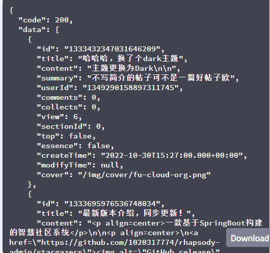
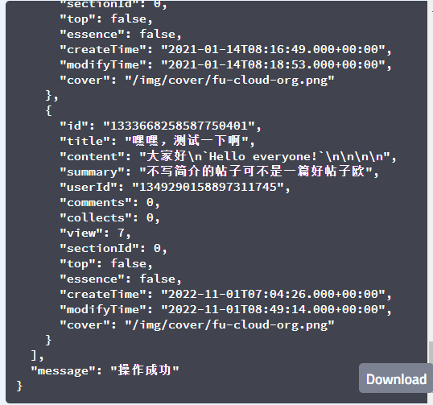

# 1.bms-post-controller/post/getRecommend-api
#### 接口简介
&emsp;&emsp;

#### 基本信息：
+ 接口状态：已完成
+ 接口地址：http://localhost:8000/post/recommend
+ 请求方式：GET
+ 请求类型：
#### 请求参数：
| 字段   | 说明 | 类型   | 备注 |
| ------ | ---- | ------ | ---- |
| postId |      | String |      |

#### 返回参数：

| 字段    | 说明       | 类型   | 备注                         |
| ------- | ---------- | ------ | ---------------------------- |
| code    | 接口状态码 | Number | 成功：200   失败：0       |
| message | 接口信息   | String | 成功：操作成功   失败：无 |
| data    | 返回数据   | Object |                              |

data

| 字段       | 说明     | 类型    | 是否非空 | 备注    |
| ---------- | -------- | ------- | -------- | ------- |
| id         | 帖子id   | String  | 是       |         |
| userId     | 用户id   | String  | 是       |         |
| alias      | 用户昵称 | String  | 否       |         |
| avatar     | 头像url  | String  | 否       |         |
| title      | 题目     | String  | 是       |         |
| comments   | 评论数   | Number  | 是       |         |
| top        | 是否置顶 | Boolean | 是       |         |
| essence    | 是否加精 | Boolean | 是       |         |
| collects   | 收藏数量 | Number  | 是       | 默认为0 |
| views      | 浏览数量 | Number  | 是       |         |
| createTime | 发布时间 | String  | 是       |         |
| modifyTime | 修改时间 | String  | 否       |         |
| cover      | 封面url  | String  | 否       |         |

#### 响应实例：

