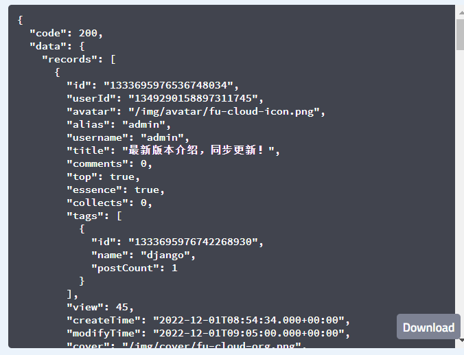
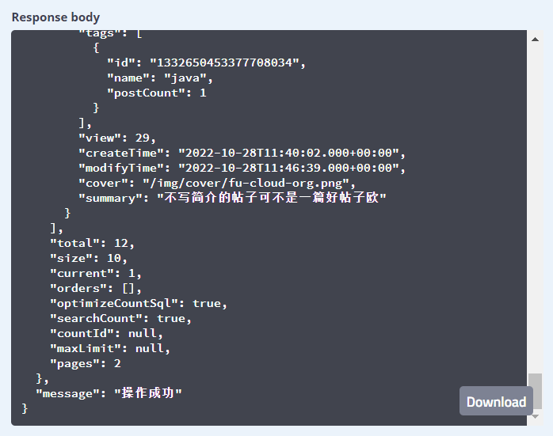

# bms-post-controller/post/list-api
#### 接口简介
&emsp;&emsp;获取首页的帖子列表

#### 基本信息：
+ 接口状态：已完成
+ 接口地址：http://localhost:8000/post/list
+ 请求方式：GET
+ 请求类型：
#### 请求参数：
|  字段   | 说明 | 类型 | 备注 | 是否必填 |
|  :---   | ----  | ---- | ---- | ---- |
| pageNo | 第几页 | Number | 默认为1 | 是 |
| size | 每页的大小 | Number | 默认为10 | 是 |
| tab | 按什么方式获取帖子列表 | String | tab取值为："hot"  或者 “latest”，默认为”latest“ | 是 |

#### 返回参数：

|  字段   | 说明 | 类型 | 备注 |
|  ----   | ----  | ---- | -------|
| code  | 接口状态码 | Number | 成功：200   失败：0 |
| message  | 接口信息 | String | 成功：操作成功   失败：无 |
| data | 返回数据 | Object |  |

data：
|  字段   | 说明 | 类型 | 备注 |
|  ----   | ----  | ---- | --------- |
| records | 帖子信息 | Object ||
| size | 页数大小 | Number | |
| current | 目前页数 | Number | |
| optimizeCountSql | 是否进行sql计数优化 | Boolean | |
| searchCount | 是否进行浏览统计 | Boolean | |

records：

|  字段   | 说明 | 类型 | 是否非空 | 备注 |
|  ----   | ----  | ---- | --------- | ---- |
| id  | 帖子id | String | 是 ||
| userId | 用户id | String | 是 ||
| alias | 用户昵称 | String | 否||
| avatar | 头像url | String | 否 ||
| title | 题目 | String  | 是 ||
| comments | 评论数 | Number | 是 ||
| top | 是否置顶 | Boolean | 是 ||
| essence | 是否加精 | Boolean | 是 | |
| collects | 收藏数量 | Number | 是 | 默认为0 |
| tags | 评论信息 | Object | 否 ||
| views | 浏览数量 | Number | 是 ||
| reateTime | 发布时间 | String | 是 ||
| modifyTime | 修改时间 | String | 否 ||
| cover | 封面url | String | 否 ||
| summary | 简介 | String | 是 |默认为：”不写简介的帖子 可不是一篇好帖子欧“|

tags：
|  字段   | 说明 | 类型 | 是否非空 | 备注 |
|  ----   | ----  | ---- | --------- | ---- |
| id  | 标签id | String | 是 ||
| name | 标签 | String | 是 ||
| postCount | 关联帖子数 | String | 是 ||

#### 响应实例：

