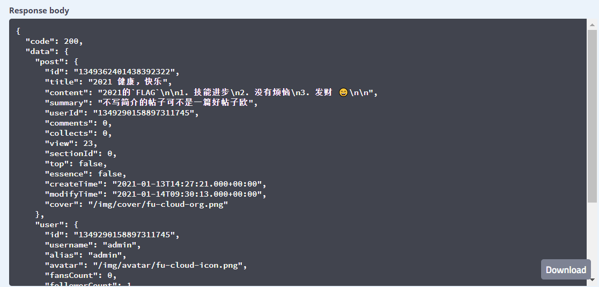
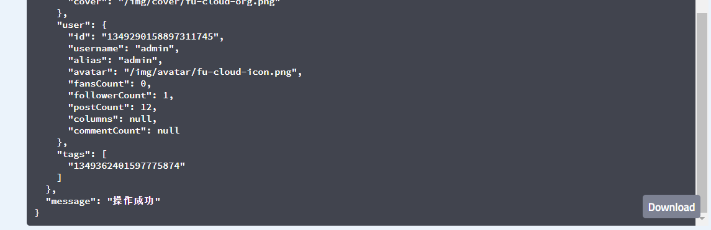

# 1.bms-post-controller/post-api
#### 接口简介
&emsp;&emsp;获取帖子内容

#### 基本信息：
+ 接口状态：已完成
+ 接口地址：http://localhost:8000/post
+ 请求方式：GET
+ 请求类型：
#### 请求参数：
|  字段   | 说明 | 类型 | 备注 | 是否必填 |
|  ----   | ----  | ---- | ---- | ---- |
| id  | 产生帖子时自动生成 | String | 无 | 是 |

#### 返回参数：

|  字段   | 说明 | 类型 | 备注 |
|  ----   | ----  | ---- | -------|
| code  | 接口状态码 | Number | 成功：200   失败：无 |
| message  | 接口信息 | String | 成功：操作成功   失败：帖子不存在或已被作者删除 |
| data | 返回数据 | Object | 是 |

data：
|  字段   | 说明 | 类型 | 备注 |
|  ----   | ----  | ---- | --------- |
| post  | 帖子信息 | Object ||
| user  | 帖子拥有者信息 | Object |  |
| tags  | 标签id | String | |

post：
|  字段   | 说明 | 类型 | 是否非空 | 备注 |
|  ----   | ----  | ---- | --------- | ---- |
| id  | 帖子id | String | 是 |
| title  | 标题 | String | 是 |
| content  | markdown内容 | String | 是 |
| userId  | 作者id | String | 是 |
| comments  | 评论统计 | Number | 是 |
| collects  | 收藏统计 | Number | 是 |
| view | 浏览统计 | Number | 是 |
| top | 是否置顶 | Number | 是 |1:是   2:否 |
| essence  | 是否加精 | Number | 是 |1:是   0:否 |
| sectionId | 问答id | Number | 否 |  |
| createTime | 发布时间 | String | 是 | |
| modifyTime | 修改时间 | String | 否 | |
| cover | 封面url | String | 否 | |

user：
|  字段   | 说明 | 类型 | 是否非空 | 备注 |
|  ----   | ----  | ---- | --------- | ---- |
| id  | 用户id | String | 是 |
| username | 用户名 | String | 是 |
| alias | 用户昵称 | String | 否|
| avatar | 头像url | String | 否 |
| fansCount | 关注人数 | Number | 是 |
| followerCount  | 被关注人数 | Number | 是 |
| postCount | 帖子数量 | Number | 是 |
| columns | 专栏数 | Number | 否 | |
| commentCount  | 评论数 | Number | 否 ||

#### 响应实例：

